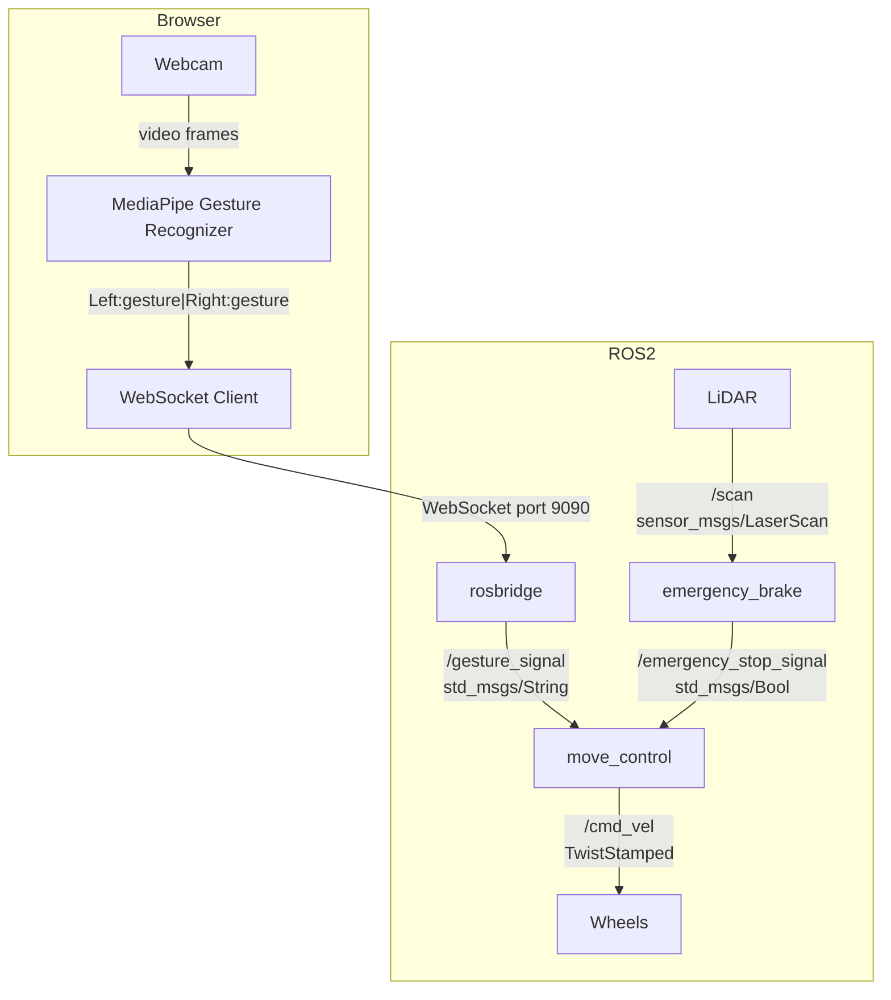
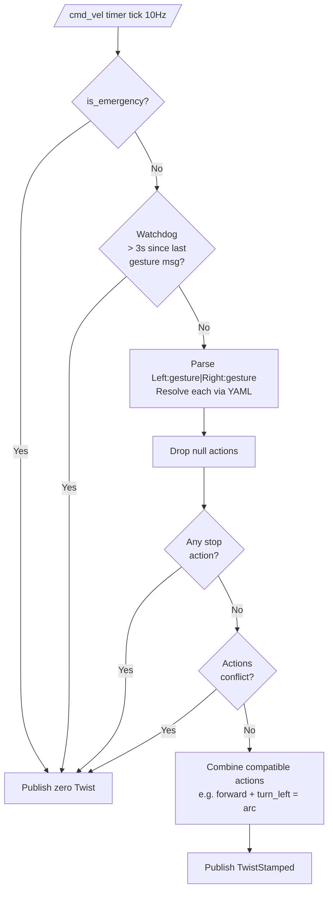
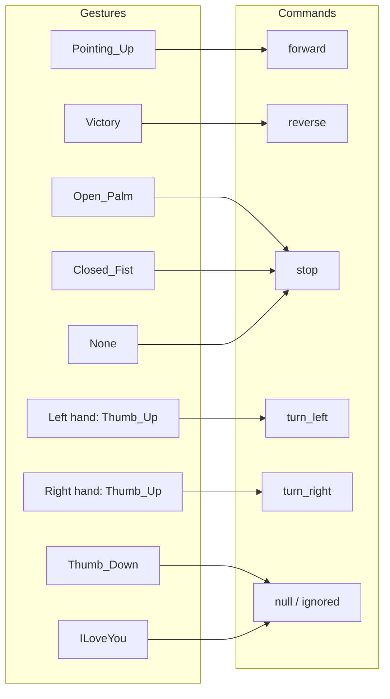

# Final Project Design Decisions

## Overview

A gesture-controlled robot using MediaPipe in the browser and ROS2 on the robot. The browser and ROS2 are kept decoupled — the browser is a pure sensor that reports what it sees, all robot logic lives in ROS2.

---

## Architecture



---

## Browser (`app.js`)

### Rosbridge Connection
- Connects via raw WebSocket to `ws://<robot-ip>:9090`
- Robot IP entered via a UI input field with a connect button
- Gesture publishing is disabled until the WebSocket connection is established
- If the connection drops, publishing stops immediately

### Gesture Message Format
- Topic: `/gesture_signal`
- Type: `std_msgs/String`
- Format: `"Left:<gesture>|Right:<gesture>"` — always both hands, always pipe-separated
- `X` was a placeholder; `<gesture>` is the actual MediaPipe label for that hand
- Uses `None` when a hand is not visible (e.g. `"Left:None|Right:Thumb_Up"`)
- Example full messages:
  - `"Left:Open_Palm|Right:None"`
  - `"Left:Victory|Right:Pointing_Up"`

### Debouncing
- Each hand is debounced independently with a 500ms time-based threshold
- A gesture must be held stably for 500ms before it is published
- A new message is published whenever either hand's debounced state changes
- The 500ms threshold is a named constant at the top of `app.js` for easy tuning

---

## ROS2

### Shared YAML Params File
One params file is passed to both nodes in the launch file. It is the single source of truth for all tunable values.

```yaml
move_control_node:
  ros__parameters:
    speeds:
      forward: 0.15      # m/s
      reverse: -0.10     # m/s (slower than forward intentionally)
      turn: 0.5          # rad/s
    watchdog_timeout: 3.0  # seconds

    # Compound key (Hand_Gesture) checked first, bare Gesture key as fallback.
    # Handedness only needs to be specified where it matters (e.g. Thumb_Up).
    gestures:
      Pointing_Up: forward
      Victory: reverse
      Open_Palm: stop
      Closed_Fist: stop
      Thumb_Up_Left: turn_left
      Thumb_Up_Right: turn_right
      Thumb_Down: null
      ILoveYou: null
      None: stop

emergency_brake_node:
  ros__parameters:
    safe_distance: 0.6   # meters
```

### `move_control` Node — Priority Logic



### `emergency_brake` Node
- Unchanged in behavior — reads `safe_distance` from YAML instead of hardcoded
- Publishes `True` on `/emergency_stop_signal` if any valid LiDAR reading in the front 40° arc is within `safe_distance`

### Multi-hand Conflict Resolution
- **Stop supersedes everything** — if either hand signals stop, the robot stops
- Compatible gestures combine: `turn_left` + `forward` → arc left while moving forward
- Incompatible non-stop gestures (e.g. `forward` + `reverse`) → stop

---

## Gesture Mapping



---

## Rosbridge

Rosbridge is **not** started in the launch file. Start it separately before launching the package:

```bash
# Terminal 1 — start rosbridge first
ros2 launch rosbridge_server rosbridge_websocket_launch.xml

# Terminal 2 — start the package
ros2 launch final_package final.launch.py --params-file <path-to-params.yaml>
```

---

## Topic Reference

| Topic | Type | Publisher | Subscriber |
|---|---|---|---|
| `/scan` | `sensor_msgs/LaserScan` | LiDAR | `emergency_brake` |
| `/emergency_stop_signal` | `std_msgs/Bool` | `emergency_brake` | `move_control` |
| `/gesture_signal` | `std_msgs/String` | rosbridge | `move_control` |
| `/cmd_vel` | `geometry_msgs/TwistStamped` | `move_control` | Wheels |
